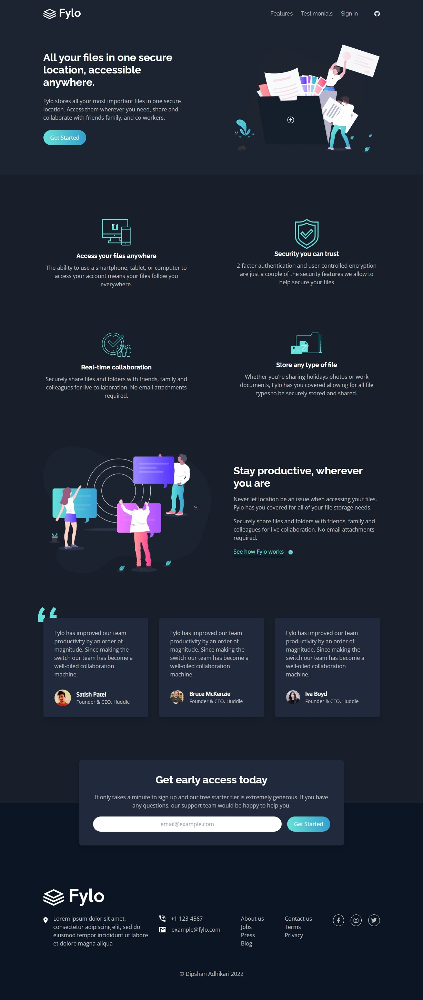

# Fylo landing page solution using Tailwind CSS

This is also a solution to the [Fylo dark theme landing page challenge on Frontend Mentor](https://www.frontendmentor.io/challenges/fylo-dark-theme-landing-page-5ca5f2d21e82137ec91a50fd). Frontend Mentor challenges help you improve your coding skills by building realistic projects.

## Table of contents

-   [Overview](#overview)
    -   [The challenge](#the-challenge)
    -   [Screenshot](#screenshot)
    -   [Links](#links)
-   [My process](#my-process)
    -   [Built with](#built-with)
    -   [What I learned](#what-i-learned)
    -   [Useful resources](#useful-resources)
-   [Author](#author)

## Overview

### The challenge

Users should be able to:

-   View the optimal layout for the site depending on their device's screen size
-   See hover states for all interactive elements on the page

### Screenshot

### Links

-   Live Site URL: [https://dipshanadhikari.com.np/tailwind-landing-page](https://dipshanadhikari.com.np/tailwind-landing-page)

## My process

### Built with

-   Semantic HTML5 markup
-   Tailwind CSS

### What I learned

I learned to use Tailwind CSS to make awesome webpages without even writing a single write of CSS

### Continued development

Later I will added JavaScript for form validation and mobile navigation menu

### Useful resources

-   [Tailwind CSS documentation](https://tailwindcss.com/docs/) - This helped me learn everything I needed to make this webpage
-   [Tailwind Crash Course | Project From Scratch](https://www.youtube.com/watch?v=dFgzHOX84xQ) - This crash course by Travesy Media taught me the basics of Tailwind

## Author

-   Website - [Dipshan Adhikari](https://www.dipshanadhikari.com.np)
-   Frontend Mentor - [@dipshanadh](https://www.frontendmentor.io/profile/dipshanadh)
-   Facebook - [dipshanadh](https://www.facebook.com/dipshnadh)
